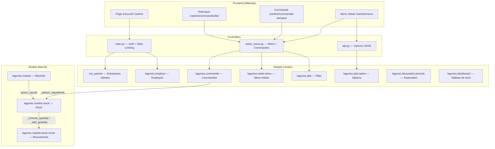
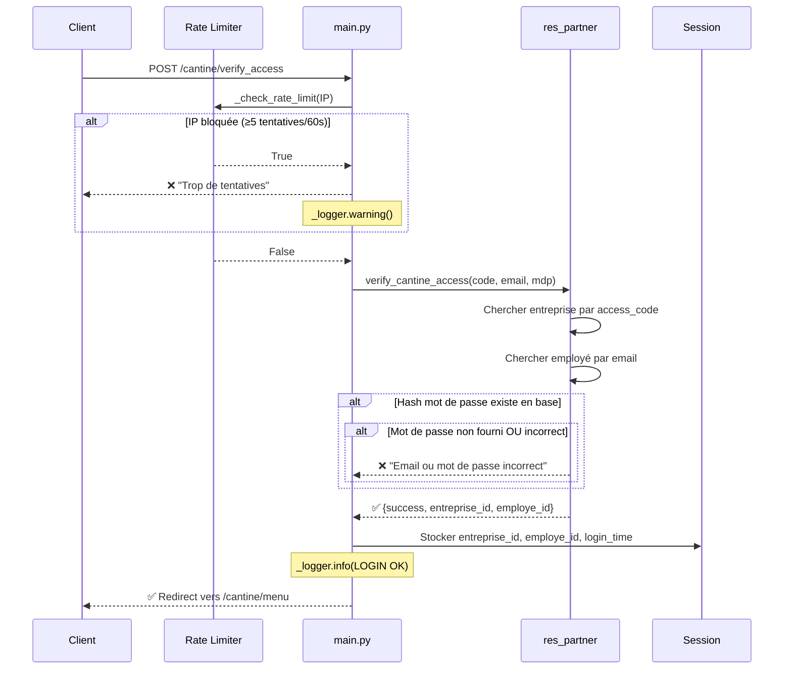
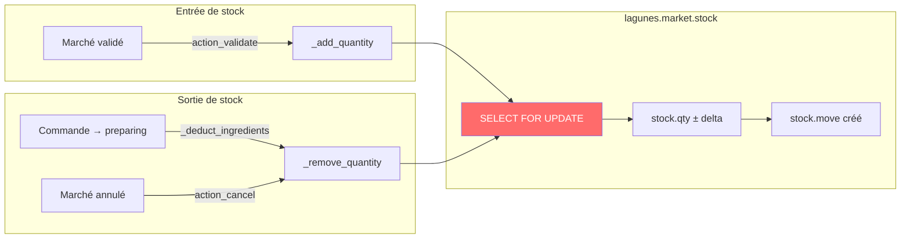
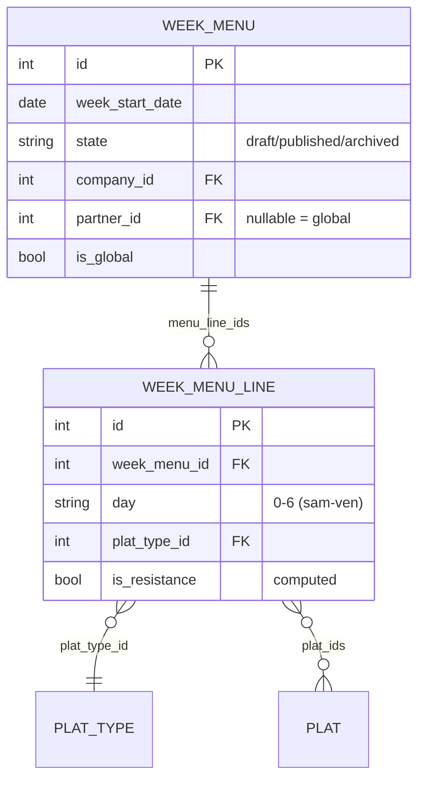
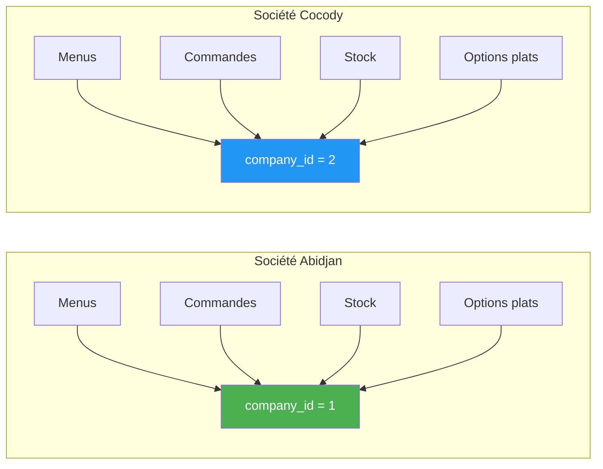
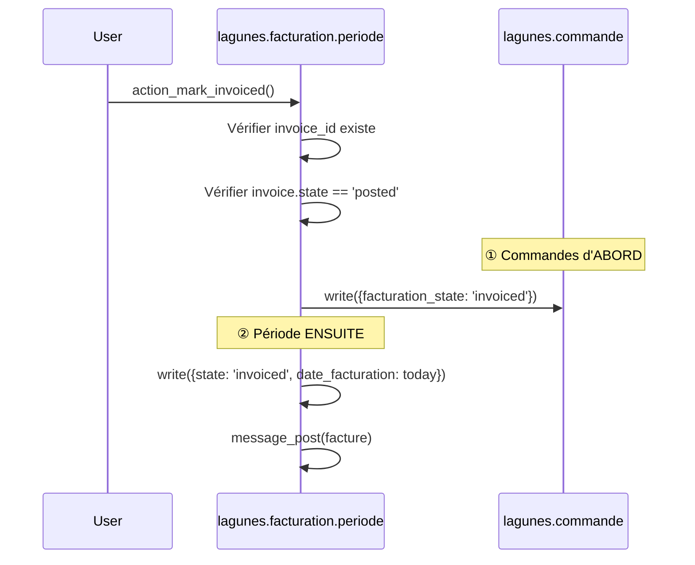

# 🏗️ Walkthrough — Modules Cantine & Marché (Odoo 18)

> Post-audit : 24 correctifs appliqués — sécurité, fonctionnel, architecture

---

## 1. Vue d'ensemble de l'architecture



---

## 2. Flux d'authentification



### Couches de sécurité (post-audit)

| Couche | Mécanisme | Fichier |
|--------|-----------|---------|
| **Rate Limiting** | 5 tentatives / 60s par IP | [main.py:32-50](file:///C:/odoo18/custom_addons/lagunes_cantine/controllers/main.py#L32-L50) |
| **Password obligatoire** | Si hash existe → vérification forcée | [res_partner.py:388-396](file:///C:/odoo18/custom_addons/lagunes_cantine/models/res_partner.py#L388-L396) |
| **Session type-safe** | `int(session_id) != int(entreprise_id)` | [week_menu.py:249-251](file:///C:/odoo18/custom_addons/lagunes_cantine/controllers/week_menu.py#L249-L251) |
| **Session expiration** | Vérification `date.today()` + `password_last_changed` | [main.py:466-495](file:///C:/odoo18/custom_addons/lagunes_cantine/controllers/main.py#L466-L495) |
| **ACL** | `group_public` : aucun droit de création | [ir.model.access.csv:15](file:///C:/odoo18/custom_addons/lagunes_cantine/security/ir.model.access.csv#L15) |
| **Record Rules** | Isolation par `company_id` (pas `commercial_partner_id`) | [lagunes_security.xml:36-62](file:///C:/odoo18/custom_addons/lagunes_cantine/security/lagunes_security.xml#L36-L62) |
| **Field groups** | `mot_de_passe` : `groups='base.group_system'` | [lagunes_employe.py:62-67](file:///C:/odoo18/custom_addons/lagunes_cantine/models/lagunes_employe.py#L62-L67) |
| **Audit logging** | Connexions réussies + IP bloquées → `_logger` | [main.py:58-74](file:///C:/odoo18/custom_addons/lagunes_cantine/controllers/main.py#L58-L74) |

---

## 3. Pipeline de gestion de stock



### Interface `_remove_quantity` (dict)

```python
# Retour standardisé — NE JAMAIS traiter comme bool
result = stock._remove_quantity(
    article_id=42,
    qty=10.0,
    note='...',
    allow_capped=True,   # ← REQUIS pour annulations
)
# result = {
#     'success': True/False,
#     'is_capped': True/False,  # stock < demandé → réduit à 0
#     'requested_qty': 10.0,
#     'actual_qty': 5.0,        # quantité effectivement retirée
# }
```

> [!WARNING]
> **Avant l'audit**, `action_cancel` traitait le retour comme un booléen (`if is_capped:`).
> Un dict non-vide est **toujours truthy** → faux positifs systématiques.
> **Corrigé** : `result.get('is_capped')` + `allow_capped=True`.

### Idempotence des déductions

```python
# lagunes_commande.py — Protection double déduction
if commande.is_stock_deducted:
    continue  # Première vérification (cache ORM)

self.env.cr.execute(
    "SELECT is_stock_deducted FROM lagunes_commande WHERE id = %s FOR UPDATE",
    (commande.id,)
)
# Deuxième vérification après verrouillage de ligne
```

### `move_category` — Valeurs disponibles

| Valeur | Usage |
|--------|-------|
| `purchase` | Achat au marché |
| `order_deduction` | Déduction commande cantine |
| `adjustment` | Ajustement manuel *(ajouté)* |
| `waste` | Perte/Déchet |
| `inventory_adjustment` | Ajustement d'inventaire |
| `leftover` | Stock initial de marché |
| `other` | Autre |

---

## 4. Menu hebdomadaire — Modèle de données



### Contraintes SQL (post-audit)

```sql
-- lagunes_week_menu_line : un seul type par jour par menu
UNIQUE(week_menu_id, day, plat_type_id)

-- lagunes_plat_option : nom unique par société
UNIQUE(name, company_id)
```

> [!IMPORTANT]
> L'ancienne `_unique_together` était **silencieusement ignorée** par l'ORM Odoo.
> Remplacée par `_sql_constraints` qui crée une vraie contrainte PostgreSQL.

### Logique `is_plat_resistance` (centralisée)

```python
# lagunes_week_menu.py — UN SEUL endroit pour cette logique
@staticmethod
def _is_plat_resistance(type_name):
    name = (type_name or '').lower()
    if not name:
        return False
    return (
        'sist' in name or 'principal' in name or
        ('entr' not in name and 'dessert' not in name)
    )

# Appelé par :
# - _compute_is_resistance()
# - _onchange_plat_type_id()
```

---

## 5. Isolation multi-société



| Modèle | `company_id` | Contrainte unique |
|--------|:------------:|:-----------------:|
| `lagunes.menu` | ✅ | — |
| `lagunes.week.menu` | ✅ | — |
| `lagunes.week.menu.line` | via parent | `(week_menu_id, day, plat_type_id)` |
| `lagunes.commande` | ✅ | — |
| `lagunes.employe` | ✅ | — |
| `lagunes.market.stock` | ✅ | — |
| `lagunes.plat.option` | ✅ *(ajouté)* | `(name, company_id)` |

---

## 6. Facturation — Ordre des opérations



> [!NOTE]
> **Avant l'audit**, la période était modifiée en premier. Si le write sur les commandes échouait, la période était déjà marquée « facturée » → incohérence.

---

## 7. Suite de tests

### Tests de sécurité ([test_security.py](file:///C:/odoo18/custom_addons/lagunes_cantine/tests/test_security.py))

| Test | Vérifie |
|------|---------|
| `test_password_field_groups` | `mot_de_passe` restreint à `base.group_system` |
| `test_password_bypass_blocked` | Connexion sans mdp impossible si hash existe |
| `test_public_cannot_create_employe` | `group_public` n'a pas `perm_create` |
| `test_session_entreprise_id_type_safety` | Comparaison `int()` fonctionne string vs int |
| `test_rate_limiter` | Blocage après 5 tentatives |
| `test_rate_limiter_window_expiry` | Déblocage après expiration de la fenêtre |
| `test_*_rule_uses_company_id` | Record rules filtrent par `company_id` |

### Tests de stock ([test_stock.py](file:///C:/odoo18/custom_addons/lagunes_cantine/tests/test_stock.py))

| Test | Vérifie |
|------|---------|
| `test_remove_quantity_returns_dict` | Retour = dict avec `success`, `is_capped`, etc. |
| `test_remove_quantity_normal` | Déduction standard fonctionne |
| `test_remove_quantity_capped` | Stock descend à 0 avec `allow_capped=True` |
| `test_remove_quantity_insufficient_no_cap` | Comportement sans `allow_capped` |
| `test_add_quantity_returns_dict` | `_add_quantity` retourne aussi un dict |
| `test_move_category_adjustment_exists` | `'adjustment'` est dans les valeurs |
| `test_deduct_twice_is_idempotent` | Double appel ne déduit qu'une fois |
| `test_cancel_uses_allow_capped` | `action_cancel` passe `allow_capped=True` |

```bash
# Lancer les tests
python odoo-bin -d <db> --test-tags lagunes_security,lagunes_stock --stop-after-init
```

---

## 8. Procédure de déploiement

```bash
# ① Nettoyage des doublons (OBLIGATOIRE avant upgrade)
python odoo-bin shell -d <db> < custom_addons/lagunes_cantine/scripts/pre_migrate_clean_duplicates.py

# ② Mise à jour des modules
python odoo-bin -d <db> -u lagunes_cantine,lagunes_market --stop-after-init

# ③ Vérification par les tests
python odoo-bin -d <db> --test-tags lagunes_security,lagunes_stock --stop-after-init
```

> [!CAUTION]
> **L'étape ① est obligatoire.** Les nouvelles contraintes SQL échoueront si des doublons existent :
> - `lagunes_week_menu_line` : `UNIQUE(week_menu_id, day, plat_type_id)`
> - `lagunes_plat_option` : `UNIQUE(name, company_id)`

---

## 9. Fichiers modifiés — Index complet

| Module | Fichier | Correctifs appliqués |
|--------|---------|---------------------|
| `lagunes_cantine` | [lagunes_employe.py](file:///C:/odoo18/custom_addons/lagunes_cantine/models/lagunes_employe.py) | Password groups restriction |
| | [res_partner.py](file:///C:/odoo18/custom_addons/lagunes_cantine/models/res_partner.py) | Auth bypass fix |
| | [lagunes_commande.py](file:///C:/odoo18/custom_addons/lagunes_cantine/models/lagunes_commande.py) | @api.depends fix |
| | [lagunes_week_menu.py](file:///C:/odoo18/custom_addons/lagunes_cantine/models/lagunes_week_menu.py) | SQL constraints + centralized logic |
| | [lagunes_facturation_periode.py](file:///C:/odoo18/custom_addons/lagunes_cantine/models/lagunes_facturation_periode.py) | Write order fix |
| | [lagunes_dashboard.py](file:///C:/odoo18/custom_addons/lagunes_cantine/models/lagunes_dashboard.py) | Imports + stock KPIs |
| | [lagunes_plat_option.py](file:///C:/odoo18/custom_addons/lagunes_cantine/models/lagunes_plat_option.py) | company_id + compute removal |
| | [main.py](file:///C:/odoo18/custom_addons/lagunes_cantine/controllers/main.py) | Rate limiting + audit logging |
| | [api.py](file:///C:/odoo18/custom_addons/lagunes_cantine/controllers/api.py) | Duplicate route + session + CSRF doc |
| | [week_menu.py](file:///C:/odoo18/custom_addons/lagunes_cantine/controllers/week_menu.py) | Session type safety |
| | [ir.model.access.csv](file:///C:/odoo18/custom_addons/lagunes_cantine/security/ir.model.access.csv) | Public ACL revoked |
| | [lagunes_security.xml](file:///C:/odoo18/custom_addons/lagunes_cantine/security/lagunes_security.xml) | company_id record rules |
| | [pre_migrate_clean_duplicates.py](file:///C:/odoo18/custom_addons/lagunes_cantine/scripts/pre_migrate_clean_duplicates.py) | **Nouveau** |
| | [test_security.py](file:///C:/odoo18/custom_addons/lagunes_cantine/tests/test_security.py) | **Nouveau** |
| | [test_stock.py](file:///C:/odoo18/custom_addons/lagunes_cantine/tests/test_stock.py) | **Nouveau** |
| `lagunes_market` | [lagunes_market.py](file:///C:/odoo18/custom_addons/lagunes_market/models/lagunes_market.py) | Dict return + allow_capped |
| | [lagunes_market_stock.py](file:///C:/odoo18/custom_addons/lagunes_market/models/lagunes_market_stock.py) | adjustment move_category |
